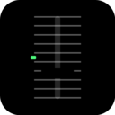

# TEMPO Slider

A browser extension that adds CDJ-style tempo and pitch controls to music purchase sites.
Listen to track previews at your **target BPM with master tempo (pitch keep)** while crate-digging.

[](https://addons.mozilla.org/addon/tempo-slider/)



## Features

- **CDJ-style UI**: Vertical TEMPO fader with ±6 / ±10 / ±16 / WIDE range, TEMPO RESET, MASTER TEMPO button (red LED), center 0 LED (green).
- **DAW-grade pitch keep**: [Rubber Band Library](https://breakfastquay.com/rubberband/) compiled to WebAssembly. Toggle MASTER TEMPO to change tempo while preserving pitch.
- **BPM display & input**: Live `original BPM × ratio = current BPM` readout. Tap input, audio-based auto detection, and DOM extraction on Beatport / Traxsource.
- **Keyboard & mouse wheel**: Mouse wheel on the fader, `,` / `.` for fine adjustment, `R` reset, `M` master tempo, `T` tap.
- **Draggable panel with position memory**: Grab the header to move the panel anywhere — position is persisted.

## Supported sites

Built-in:
- **Bandcamp**
- **Beatport**
- **Traxsource**

Other sites: add any site dynamically via the toolbar popup ("+ Add this site"). Permission is requested on demand.

## Install

### Chrome / Edge (developer mode)

1. Open `chrome://extensions/`
2. Enable Developer mode
3. Click "Load unpacked" and select the `src/` directory

### Firefox (developer mode, 128+)

1. Open `about:debugging#/runtime/this-firefox`
2. Click "Load Temporary Add-on" and select `src/manifest.json`

### Firefox (from AMO)

Install directly from [Firefox Add-ons](https://addons.mozilla.org/addon/tempo-slider/).

### Chrome / Edge

Chrome Web Store submission pending review.

## Keyboard shortcuts

| Key | Action |
|---|---|
| `,` / `.` | Tempo ±0.1% (Shift = ±1.0%) |
| `R` | TEMPO RESET (back to 0%) |
| `M` | Toggle MASTER TEMPO |
| `T` | TAP |
| Mouse wheel on fader | ±0.1% (Shift = ±1.0%) |

All shortcuts are disabled while focus is on a text input.

## Architecture

- **content.js**: Panel UI, fader, BPM calculation, site detection.
- **page-inject.js** (Beatport / Traxsource): Main-world injection. Monkey-patches `Audio` constructor, `createBufferSource`, and `HTMLMediaElement.play` to capture audio sources that don't appear in the DOM.
- **rubberband-worklet.js**: [rubberband-web](https://github.com/delude88/rubberband-web) v0.2.1, vendored as-is. WASM-based time-stretching / pitch-shifting running inside the page's AudioContext.
- **background.js**: Service worker. Dynamically registers content scripts and declarativeNetRequest rules for sites the user has added.
- **rules.json** (static) + dynamic DNR rules: Remove CSP headers on supported pages (so Emscripten's `new Function` can run) and inject CORS headers on audio CDN responses.

## License

[GPL-2.0](LICENSE) — required because the bundled Rubber Band Library is GPL-2.0-or-later.

## Privacy

See [PRIVACY.md](PRIVACY.md). No data is collected or transmitted. All processing happens locally in your browser.

## Development / build

### Requirements
- bash / zip / git
- (optional) Node.js + npm — only needed to refresh `rubberband-worklet.js`

### Commands
```bash
# Extension ZIP (for store submission)
./scripts/build.sh
# → dist/tempo-slider-X.X.X.zip

# Source ZIP (for Firefox AMO source code submission)
./scripts/build-source.sh
# → dist/tempo-slider-source-X.X.X.zip
```

### Build instructions for AMO reviewers

This extension does **not** use transpilation, minification, or obfuscation for its own code. All files under `src/` are hand-written JavaScript / CSS / HTML / JSON and run as-is.

The only machine-generated file is `src/rubberband-worklet.js`, which is the unmodified pre-built file from the npm package [`rubberband-web@0.2.1`](https://www.npmjs.com/package/rubberband-web) (a webpack-bundled build of the Rubber Band Library compiled to WebAssembly). This falls under AMO's exception for "open-source third-party libraries".

To reproduce this file:

```bash
npm pack rubberband-web@0.2.1
tar -xzf rubberband-web-0.2.1.tgz
cp package/public/rubberband-processor.js src/rubberband-worklet.js
```

Original repository: https://github.com/delude88/rubberband-web (GPL-2.0-or-later)

Verify integrity:
```bash
sha256sum src/rubberband-worklet.js package/public/rubberband-processor.js
# → both files should have identical hashes
```
